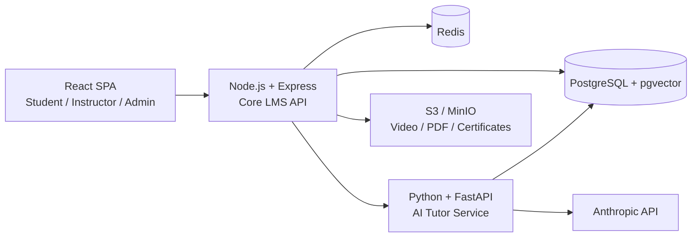

# VertexLearn AI Architecture

## AI Tutor request flow

1. Authenticated client sends course id + question.
2. AI service retrieves course-scoped document chunks from pgvector.
3. Retrieved context is passed to the LLM with an instruction to answer only from course context.
4. The API returns the answer and source lecture references.
5. A production extension should persist session/messages and enqueue mastery-score updates.
